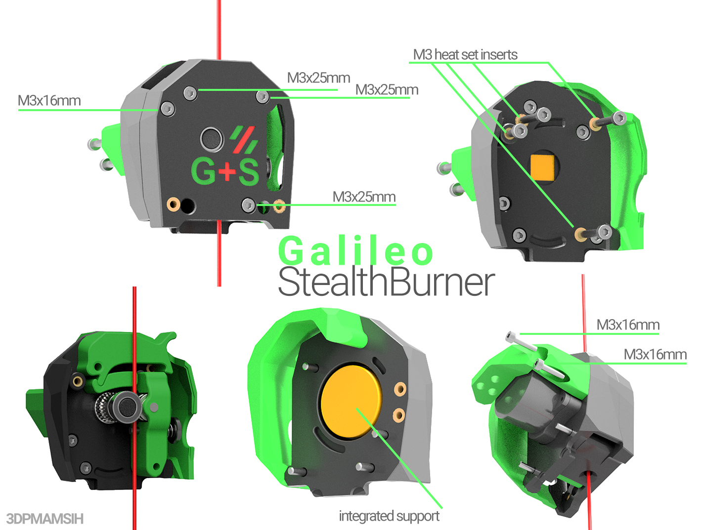
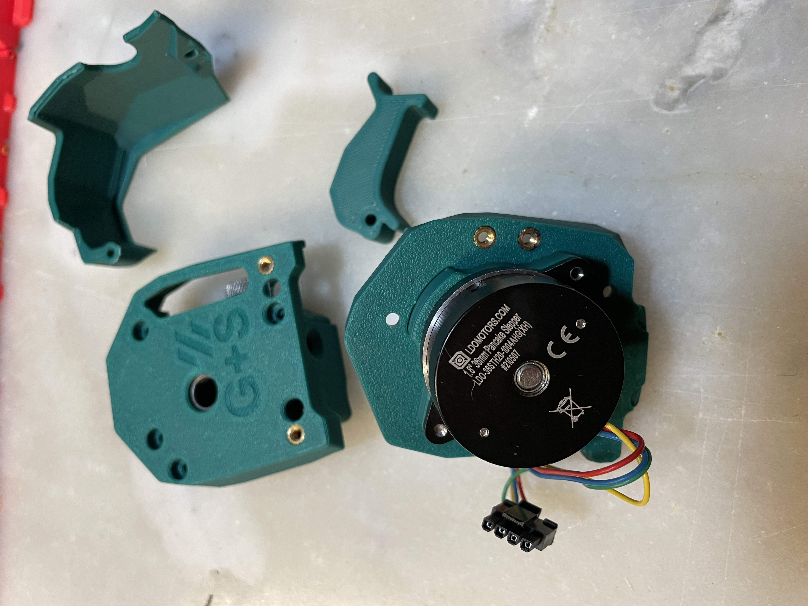
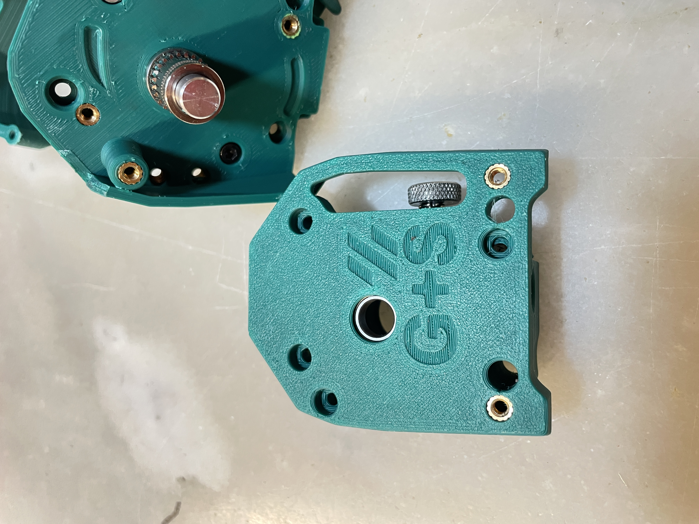
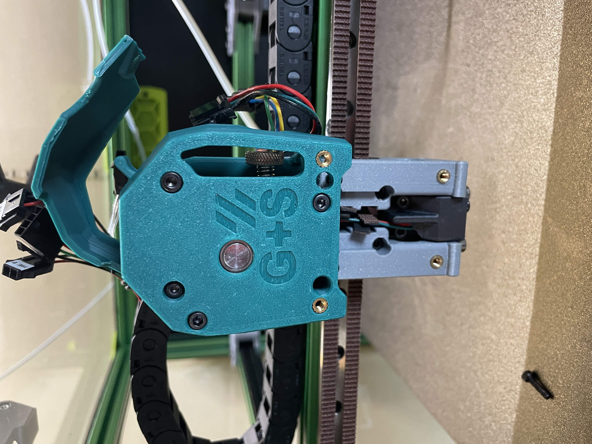

# Galileo extruder for stealthBurner
This extruder based on JaredC01 Galileo extruder share same componants (Bom) so Big thanks to him to allow me to do this for this on StealthBurner toolhead  

# https://github.com/JaredC01/Galileo

# BOM 
- Galileo componants 
- 4x M3X25
- 3x M3X16mm 
- 8x heat brass insert (BOM insert)

## Gallery

## Appreciate my work ?

buy me a coffee 
https://www.paypal.com/donate/?hosted_button_id=9EL8CEDVY28DA
thank you and happy printing 
